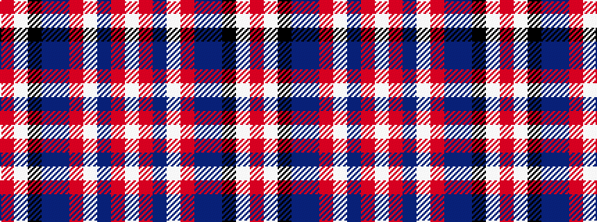

RWKBBRWBRW

It is a 10 stripe tartan.

<figure class="pat-woven">

<figcaption>idealised sample</figcaption>
</figure>

## Colour Sequence



## Tartans with this colour sequence

| Tartans |
|---------------|
| [Voluntary Service Aberdeen](/variants/s10/o4w1k35n1dt2m4w1dt14m8w1~x2/)|
||
