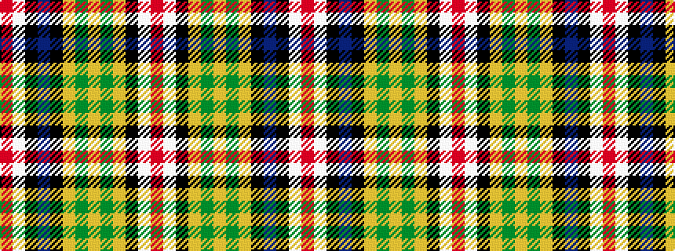

RWKBKYGYGYKWR

It is a 13 stripe tartan.

<figure class="pat-woven">

<figcaption>idealised sample</figcaption>
</figure>

## Colour Sequence



## Tartans with this colour sequence

| Tartans |
|---------------|
| [Cahaba Memorial (Commemorative)](/variants/s13/o2w3k1t9k1lr6g1lr3g1lr19k2w7o1~x2/)|
||
