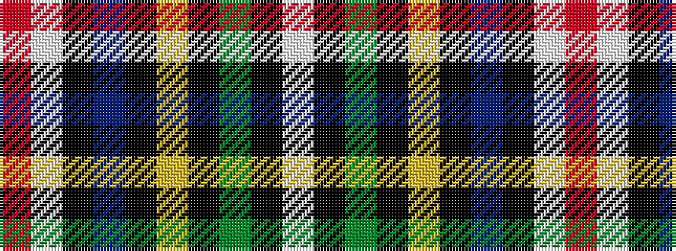

RWKBKYKGKW

It is a 10 stripe tartan.

<figure class="pat-woven">

<figcaption>idealised sample</figcaption>
</figure>

## Colour Sequence



## Tartans with this colour sequence

| Tartans |
|---------------|
| [Fermanagh County Crest (Fashion)](/setts/s10/r4w6k10db5k3lo16k3g33k1w4~x2/)|
||
