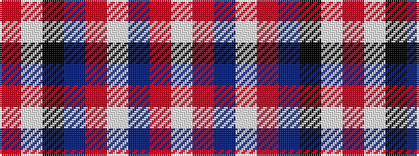

RWKBRWBRW

It is a 9 stripe tartan.

<figure class="pat-woven">

<figcaption>idealised sample</figcaption>
</figure>

## Colour Sequence



## Tartans with this colour sequence

| Tartans |
|---------------|
| [Midnight Balmoral (Fashion)](/setts/s9/o4w1k36db2r4w1db14r8w1~x2/)|
||
