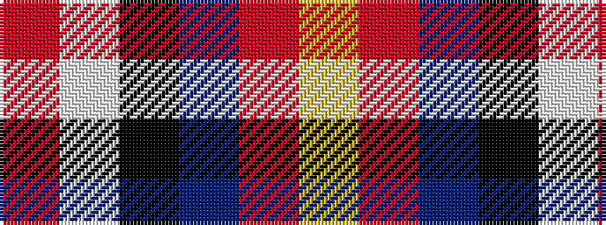

RWKBRY

It is a 6 stripe tartan.

<figure class="pat-woven">

<figcaption>idealised sample</figcaption>
</figure>

## Colour Sequence



## Tartans with this colour sequence

| Tartans |
|---------------|
| [Alan Stone Family (Personal)](/setts/s6/r2w6k12db36o12ly1~x2/)|
||
| [Stone, Alan (Personal)](/setts/s6/r2w6k12n36o12ly1~x2/)|
||
