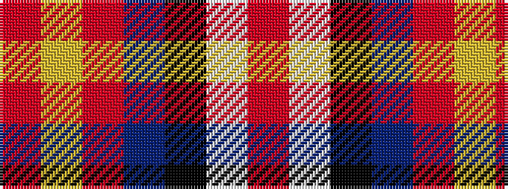

RWKBRYR

It is a 7 stripe tartan.

<figure class="pat-woven">

<figcaption>idealised sample</figcaption>
</figure>

## Colour Sequence



## Tartans with this colour sequence

| Tartans |
|---------------|
| [Solberg-Wormald (Personal)](/setts/s7/r155lb16k34db48r18ly6r9/)|
||
