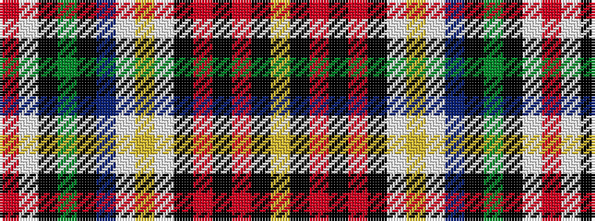

RWKGKBWYWKRKRKY

It is a 15 stripe tartan.

<figure class="pat-woven">

<figcaption>idealised sample</figcaption>
</figure>

## Colour Sequence



## Tartans with this colour sequence

| Tartans |
|---------------|
| [Innes Dress (Dance)](/variants/s15/lg4k12r2k2r2k2w12ly2w3b6k3g12k2w3r2~x3/)|
||
