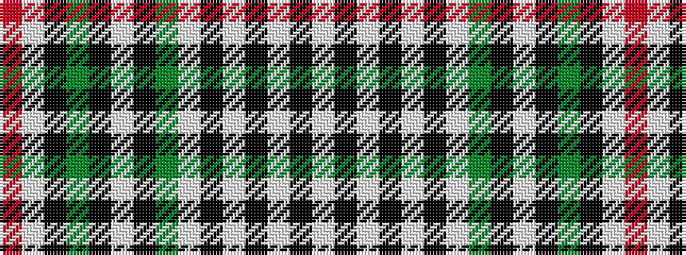

RWKGKWKGWKWKWKW

It is a 15 stripe tartan.

<figure class="pat-woven">

<figcaption>idealised sample</figcaption>
</figure>

## Colour Sequence



## Tartans with this colour sequence

| Tartans |
|---------------|
| [MacKenzie (MacGregor-Hastie)](/setts/s15/w10k3w3k3w3k5w5g9k1w2k1g9k10w13r2~x2/)|
||
