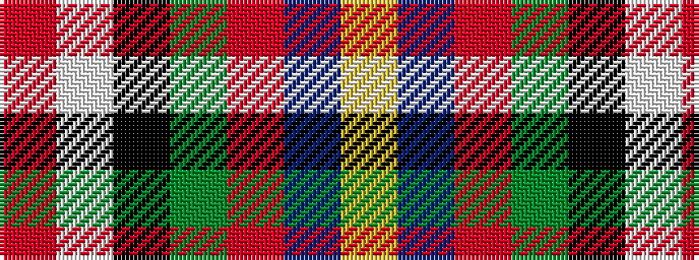

RWKGRBY

It is a 7 stripe tartan.

<figure class="pat-woven">

<figcaption>idealised sample</figcaption>
</figure>

## Colour Sequence



## Tartans with this colour sequence

| Tartans |
|---------------|
| [Alabama (Fashion)](/variants/s7/r3lb8k9g16r12n12lo3~x2/)|
||
