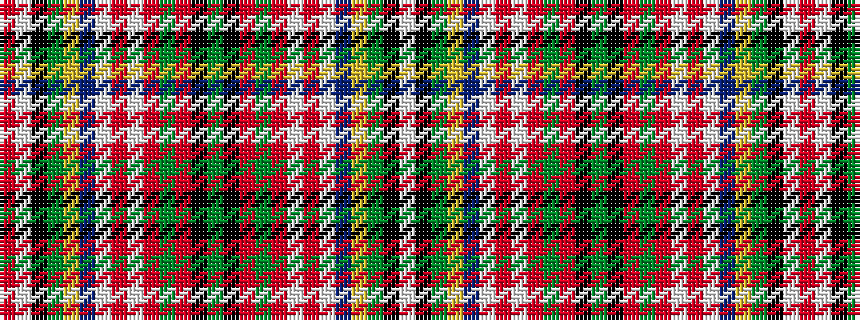

RWKGYBWRWRGRKGKRGRWRWBYGKW

It is a 26 stripe tartan.

<figure class="pat-woven">

<figcaption>idealised sample</figcaption>
</figure>

## Colour Sequence



## Tartans with this colour sequence

| Tartans |
|---------------|
| [Norwich No.058](/setts/s26/r12w1k1g12ly1db5lt6r2lt2r4g2r2k2g2~x2/)|
||
