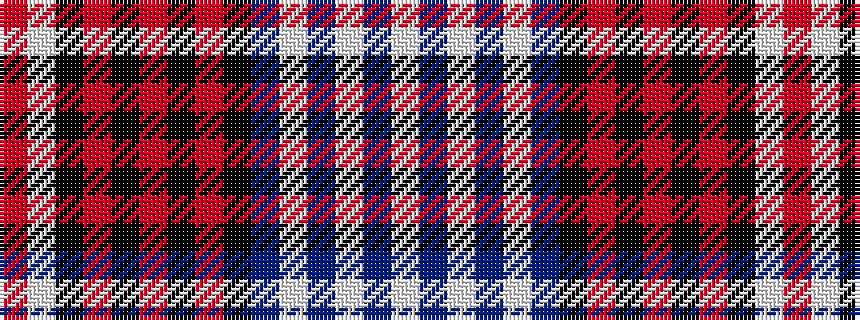

RWKRKRKRKBWBWBW

It is a 15 stripe tartan.

<figure class="pat-woven">

<figcaption>idealised sample</figcaption>
</figure>

## Colour Sequence



## Tartans with this colour sequence

| Tartans |
|---------------|
| [Missouri](/setts/s15/w4db16w2db1w2db8k1r4k2r4k2r24k1w8r2~x2/)|
||
