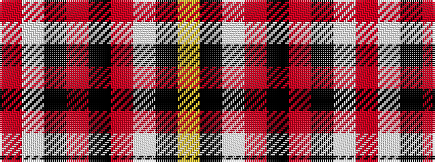

RWKRKRWKY

It is a 9 stripe tartan.

<figure class="pat-woven">

<figcaption>idealised sample</figcaption>
</figure>

## Colour Sequence



## Tartans with this colour sequence

| Tartans |
|---------------|
| [Norton (Corporate)](/variants/s9/ly75k6w3o2k6o2k6w3o2/)|
||
