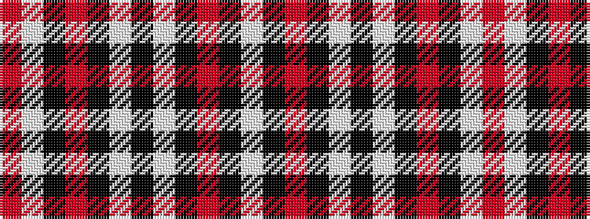

RWKRKWKWKRKW

It is a 12 stripe tartan.

<figure class="pat-woven">

<figcaption>idealised sample</figcaption>
</figure>

## Colour Sequence



## Tartans with this colour sequence

| Tartans |
|---------------|
| [Buildbase](/setts/s12/r8w1k3r3k10w3k5w25k3r3k12w3~x2/)|
||
