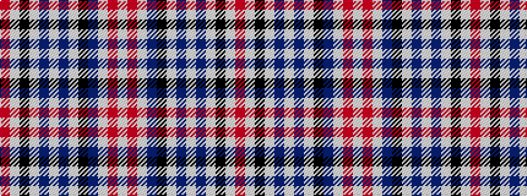

RWKWBWBWKBWRW

It is a 13 stripe tartan.

<figure class="pat-woven">

<figcaption>idealised sample</figcaption>
</figure>

## Colour Sequence



## Tartans with this colour sequence

This pattern is a design lineage: every tartan below shares one colour order, whatever its owner —
near-identical designs are grouped, the largest lineage first (#112: the pattern is a tartan's
second parent, beside its family or clan).

<table class="sett-table">
<tbody>
<tr><td><a href="/variants/s13/lb9r5lb47n13k11lb5n5lb5n21lb11k5lb5r5/">Balmoral (Old and Rare) Royal Tartan</a></td></tr>
<tr><td class="sett-swatch"></td></tr>
<tr><td><a href="/variants/s13/lb5r3lb24n7k6lb3n3lb3n11lb6k3lb3r3~x2/">Balmoral (Royal)</a></td></tr>
<tr><td class="sett-swatch"></td></tr>
<tr><td><a href="/variants/s13/lb9r5lb51n13k13lb5n4lb5n23lb11k5lb5r5/">Balmoral Gillies (Royal)</a></td></tr>
<tr><td class="sett-swatch"></td></tr>
<tr class="cluster-sep"><td></td></tr>
<tr><td><a href="/variants/s13/w4r2w11n2k2w1n1w1n4w2k1w1r1~x2/">Balmoral</a></td></tr>
<tr><td class="sett-swatch"></td></tr>
<tr><td><a href="/variants/s13/w2r1w8n2k2w1n1w1n4w2k1w1r1~x4/">Balmoral (Ghillies white variation)</a></td></tr>
<tr><td class="sett-swatch"></td></tr>
</tbody>
</table>

