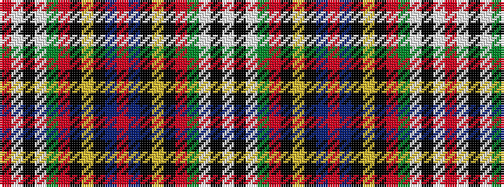

RWKWGRKYKBRBKYKRGWKW

It is a 20 stripe tartan.

<figure class="pat-woven">

<figcaption>idealised sample</figcaption>
</figure>

## Colour Sequence



## Tartans with this colour sequence

| Tartans |
|---------------|
| [Hawick (Trade Sett)](/variants/s20/w2k2w3g4r2k2ly2k3b2r32b2k3ly2k2r2g4w3k2w2r1~x2/)|
||
