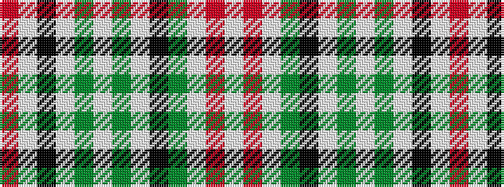

RWKWGWGWKGWRW

It is a 13 stripe tartan.

<figure class="pat-woven">

<figcaption>idealised sample</figcaption>
</figure>

## Colour Sequence



## Tartans with this colour sequence

| Tartans |
|---------------|
| [Balmoral](/setts/s13/lb4r2lb11y2k2lb1y1lb1y4lb2k1lb1r1~x2/)|
||
