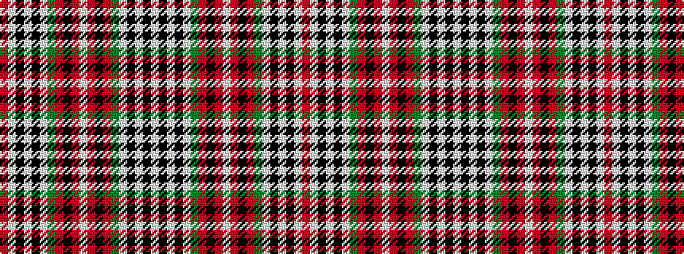

RWKWKWGRKRWRKRGWKWKW

It is a 20 stripe tartan.

<figure class="pat-woven">

<figcaption>idealised sample</figcaption>
</figure>

## Colour Sequence



## Tartans with this colour sequence

| Tartans |
|---------------|
| [Stewart/Stuart Royal (VS)](/variants/s20/w28k2w2k2w2g12r8k1r1w1r1k1r8g12w2k2w2k2w28r3~x2/)|
||
