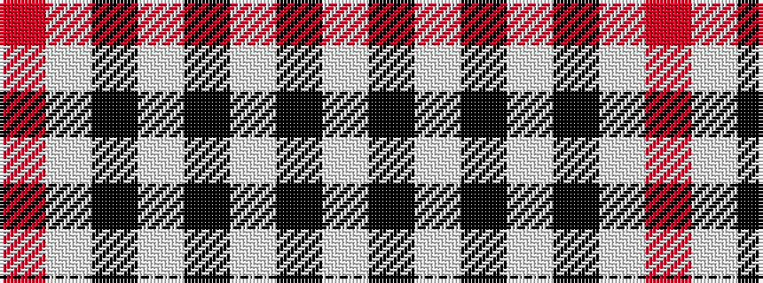

RWKWKWKW

It is a 8 stripe tartan.

<figure class="pat-woven">

<figcaption>idealised sample</figcaption>
</figure>

## Colour Sequence



## Tartans with this colour sequence

| Tartans |
|---------------|
| [Glen Feshie Check](/setts/s8/r4w4k3w4k4w4k4w4~x2/)|
||
| [Masai Shuka 14 (Artefact)](/setts/s8/r40w40k5w2k6w2k5w6~x2/)|
||
