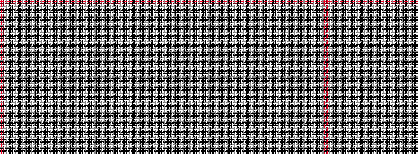

RWKWKWKWKWKWKWKWKWKWKWKWKWKWKWKWKWKWKW

It is a 38 stripe tartan.

<figure class="pat-woven">

<figcaption>idealised sample</figcaption>
</figure>

## Colour Sequence



## Tartans with this colour sequence

| Tartans |
|---------------|
| [Kerr Shepherd's Plaid](/setts/s38/r1w1k1w1k1w1k1w1k1w1k1w1k1w1k1w1k1w1k1w1~x8/)|
||
