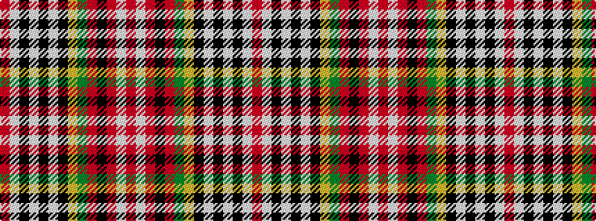

RWKWKWKYGRKRWR

It is a 14 stripe tartan.

<figure class="pat-woven">

<figcaption>idealised sample</figcaption>
</figure>

## Colour Sequence



## Tartans with this colour sequence

| Tartans |
|---------------|
| [Caledonian Cameron Commando](/variants/s14/r21lt9k2lt2k2lt9k18ly3dg21r13k3r13w2r13~x2/)|
||
