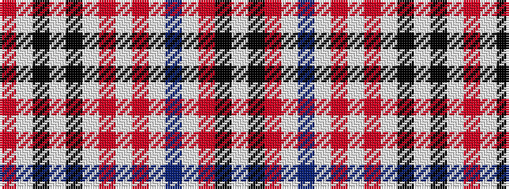

RWKWKWRWRWBWRKW

It is a 15 stripe tartan.

<figure class="pat-woven">

<figcaption>idealised sample</figcaption>
</figure>

## Colour Sequence



## Tartans with this colour sequence

| Tartans |
|---------------|
| [Ivanka Trump (Personal)](/setts/s15/r12w2k4w4k1w24r2w2r2w2t1w1m3k2w12~x2/)|
||
