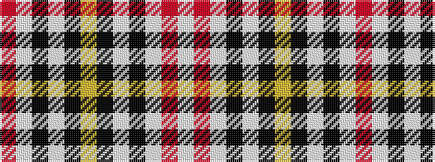

RWKWKYKWKWRW

It is a 12 stripe tartan.

<figure class="pat-woven">

<figcaption>idealised sample</figcaption>
</figure>

## Colour Sequence



## Tartans with this colour sequence

| Tartans |
|---------------|
| [MacPherson Dress Clan Tartan](/variants/s12/w6m4w32k32w5k12ly4~x2/)|
||
