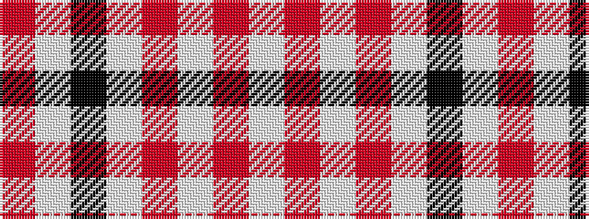

RWKWRWRW

It is a 8 stripe tartan.

<figure class="pat-woven">

<figcaption>idealised sample</figcaption>
</figure>

## Colour Sequence



## Tartans with this colour sequence

| Tartans |
|---------------|
| [Clayton Dress (Dance)](/setts/s8/r14w35k4w35r14w8r14w8~x2/)|
||
