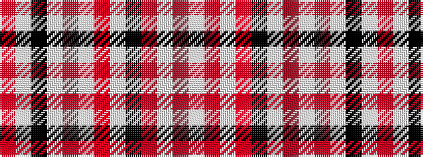

RWKWRWRWKRWRW

It is a 13 stripe tartan.

<figure class="pat-woven">

<figcaption>idealised sample</figcaption>
</figure>

## Colour Sequence



## Tartans with this colour sequence

| Tartans |
|---------------|
| [Balmoral (Ghillies white variation)](/variants/s13/w2r1w8o2k2w1o1w1o4w2k1w1r1~x4/)|
||
