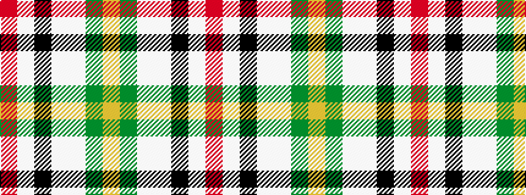

RWKWWGY

It is a 7 stripe tartan.

<figure class="pat-woven">

<figcaption>idealised sample</figcaption>
</figure>

## Colour Sequence



## Tartans with this colour sequence

| Tartans |
|---------------|
| [Ch. Supt. Everett and Mrs Julene Sum](/variants/s7/r9w27k7w45lb60dg4lo5/)|
||
| [Ch. Supt. Everett and Mrs Julene Summerfield Dress](/variants/s7/r9w25k7w45lt60g4ly5/)|
||
