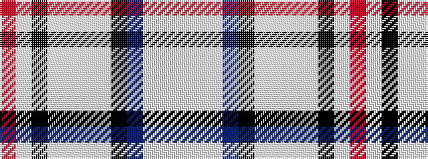

RWKWWWWKBWWW

It is a 12 stripe tartan.

<figure class="pat-woven">

<figcaption>idealised sample</figcaption>
</figure>

## Colour Sequence



## Tartans with this colour sequence

| Tartans |
|---------------|
| [Diana Princess of Wales Memorial, The](/setts/s12/w2w1w12db6k3lt1w1lt4w2k1w1r1~x4/)|
||
