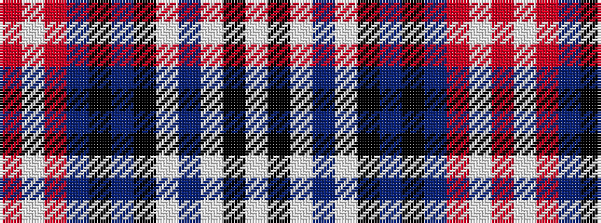

RWRBKBKWBWKW

It is a 12 stripe tartan.

<figure class="pat-woven">

<figcaption>idealised sample</figcaption>
</figure>

## Colour Sequence



## Tartans with this colour sequence

| Tartans |
|---------------|
| [YMCA](/setts/s12/r4w1r36db4k1db3k10w1db4w1k8w1~x2/)|
||
| [YMCA (Corporate)](/setts/s12/r4w1r36dt4k1dt3k10w1dt4w1k8w1~x2/)|
||
