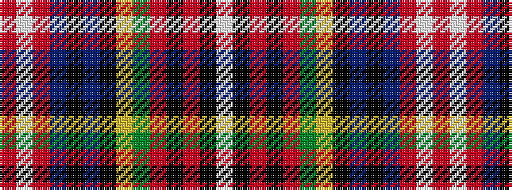

RWRBKBKYGRKRKW

It is a 14 stripe tartan.

<figure class="pat-woven">

<figcaption>idealised sample</figcaption>
</figure>

## Colour Sequence



## Tartans with this colour sequence

| Tartans |
|---------------|
| [Unidentified Bedspread](/variants/s14/r20w6r100db15k10db15k40ly5dg54r15k5r15k6w8/)|
||
| [Unidentified, Bedspread](/variants/s14/r20w6r100db15k10db15k40ly5g54r15k5r15k6w8/)|
||
