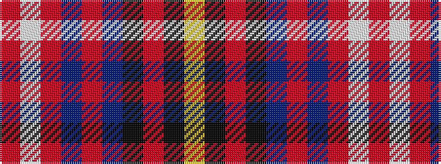

RWRBRBKRKY

It is a 10 stripe tartan.

<figure class="pat-woven">

<figcaption>idealised sample</figcaption>
</figure>

## Colour Sequence



## Tartans with this colour sequence

| Tartans |
|---------------|
| [Locky](/variants/s10/r3w2r2db2r2db24k28r2k3ly1~x2/)|
||
