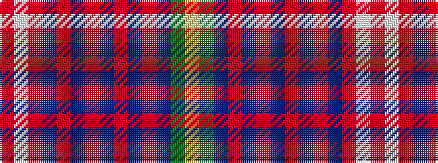

RWRBRBRBRBRBGY

It is a 14 stripe tartan.

<figure class="pat-woven">

<figcaption>idealised sample</figcaption>
</figure>

## Colour Sequence



## Tartans with this colour sequence

| Tartans |
|---------------|
| [Cairn (Fashion)](/setts/s14/o3w20r1db1r1db3r4db2r4db2r4db1y8ly1~x4/)|
||
