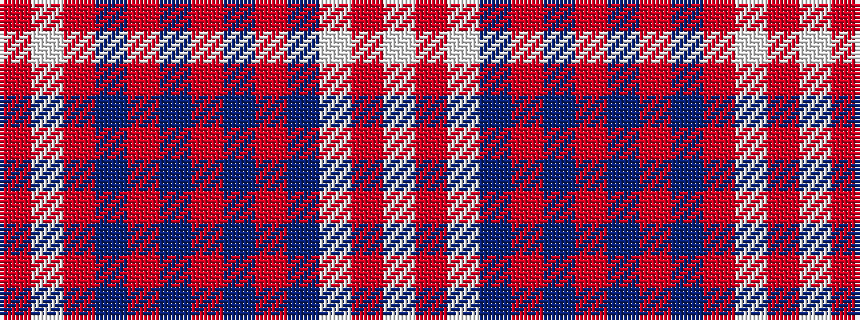

RWRBRBRBRBWRW

It is a 13 stripe tartan.

<figure class="pat-woven">

<figcaption>idealised sample</figcaption>
</figure>

## Colour Sequence



## Tartans with this colour sequence

| Tartans |
|---------------|
| [International Council for Commercial Arbitration](/variants/s13/o2w1o12db2r1db18r1b18r1b2w12o1w1~x2/)|
||
