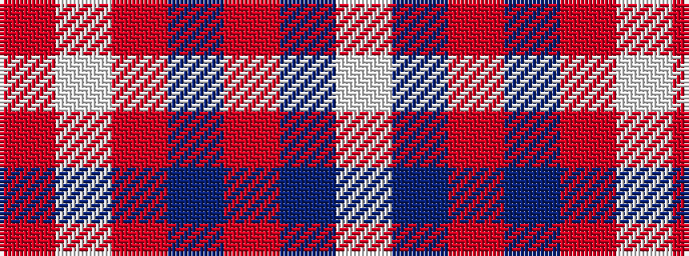

RWRBRBW

It is a 7 stripe tartan.

<figure class="pat-woven">

<figcaption>idealised sample</figcaption>
</figure>

## Colour Sequence



## Tartans with this colour sequence

| Tartans |
|---------------|
| [Unidentified Fisherwife's Plaid](/setts/s7/w80t1r14t9r24w2r4~x2/)|
||
