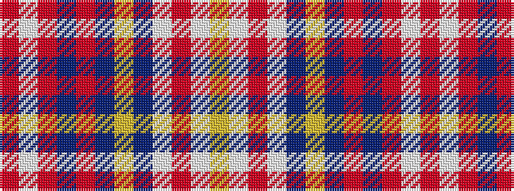

RWRBRBYBWRWY

It is a 12 stripe tartan.

<figure class="pat-woven">

<figcaption>idealised sample</figcaption>
</figure>

## Colour Sequence



## Tartans with this colour sequence

| Tartans |
|---------------|
| [Rathmore](/setts/s12/r10lb1r2n1r1n1lo1n4lb2r1lb2lo1~x8/)|
||
| [Rathmore (Fashion)](/setts/s12/r40lb2r6n2r2n2lo2n9w5r2w4lo1~x2/)|
||
