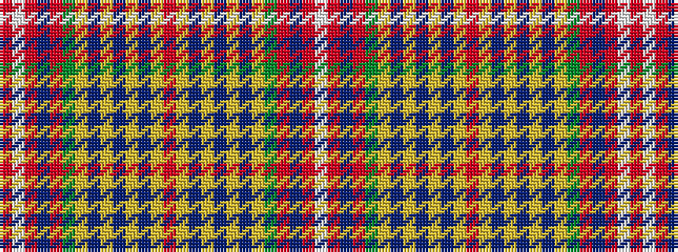

RWRBRGYBYBYBYRYBYBYBYGRBRW

It is a 26 stripe tartan.

<figure class="pat-woven">

<figcaption>idealised sample</figcaption>
</figure>

## Colour Sequence



## Tartans with this colour sequence

| Tartans |
|---------------|
| [Unidentified Scarlett #15](/variants/s26/r17lg8do2lg2do2lg8do14lo3dy17r9do3r9w2r9~x2/)|
||
