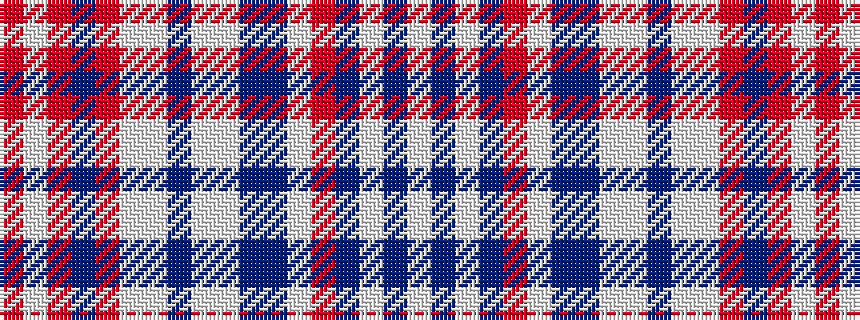

RWRBRWWBWWBBWRBWBW

It is a 18 stripe tartan.

<figure class="pat-woven">

<figcaption>idealised sample</figcaption>
</figure>

## Colour Sequence



## Tartans with this colour sequence

| Tartans |
|---------------|
| [Welly (Personal)](/variants/s18/o1lp1o1b1o1w1lp1b1w1lp1b1dp1lp1o1n1lp1b1w1~x10/)|
||
