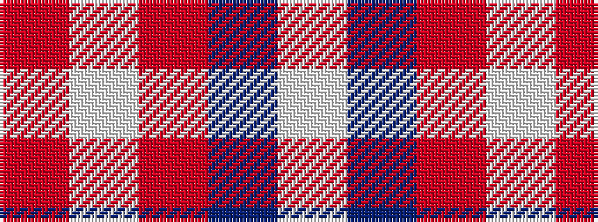

RWRBW

It is a 5 stripe tartan.

<figure class="pat-woven">

<figcaption>idealised sample</figcaption>
</figure>

## Colour Sequence



## Tartans with this colour sequence

| Tartans |
|---------------|
| [Loch Morar](/setts/s5/r38w9r3dr9w3~x2/)|
||
| [Loch Morar Trade Tartan Tartan Number: 1701. Earliest known date: pre 2003 Nothing See products available Copyright © Blair Urquhart, Comrie, 2015](/setts/s5/r38w9r3do9w3~x2/)|
||
| [Loch Tummel](/setts/s5/o38w9o3dr9w3~x2/)|
||
