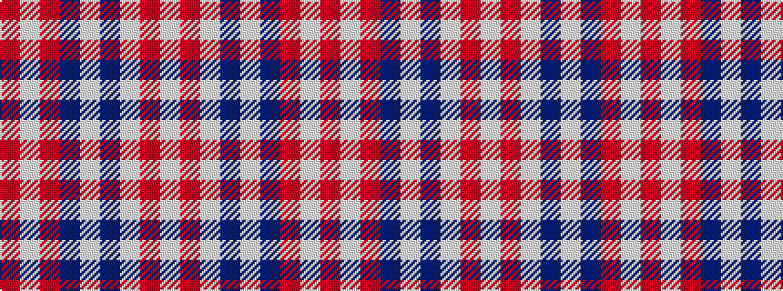

RWRBWBWRW

It is a 9 stripe tartan.

<figure class="pat-woven">

<figcaption>idealised sample</figcaption>
</figure>

## Colour Sequence



## Tartans with this colour sequence

| Tartans |
|---------------|
| [Dogrobes](/variants/s9/r3w2r9dt15w2dt15lb9r2lb3~x2/)|
||
