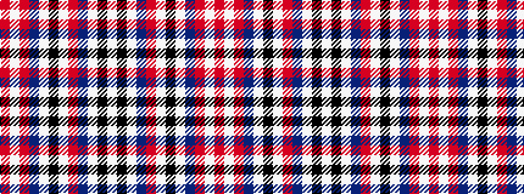

RWRBWKWRBWKW

It is a 12 stripe tartan.

<figure class="pat-woven">

<figcaption>idealised sample</figcaption>
</figure>

## Colour Sequence



## Tartans with this colour sequence

| Tartans |
|---------------|
| [Westgaard Ladies' (Personal)](/variants/s12/r9lb4r6b4lb2k2lb2r5b3lb2k2lb2~x2/)|
||
| [Westgaard of Kileughterco (Personal)](/variants/s12/r15w7r10db7w3k3w3r8db5w3k3w3~x2/)|
||
