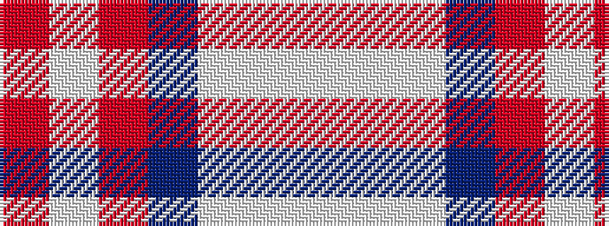

RWRBWWW

It is a 7 stripe tartan.

<figure class="pat-woven">

<figcaption>idealised sample</figcaption>
</figure>

## Colour Sequence



## Tartans with this colour sequence

| Tartans |
|---------------|
| [Kuehle (Personal)](/setts/s7/lp6wi2lp1db6o30w1r3~x2/)|
||
