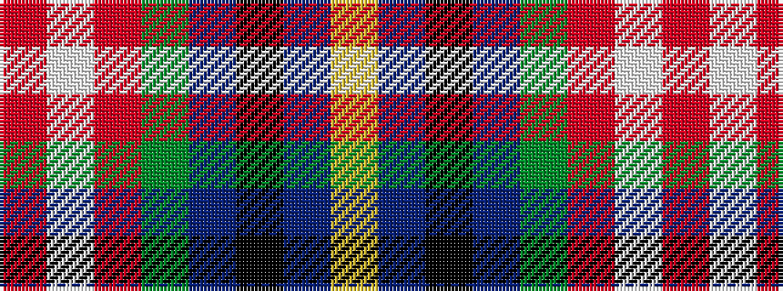

RWRGBKBY

It is a 8 stripe tartan.

<figure class="pat-woven">

<figcaption>idealised sample</figcaption>
</figure>

## Colour Sequence



## Tartans with this colour sequence

| Tartans |
|---------------|
| [Canadian Centennial](/setts/s8/r3w6r2dg32db36k2db4lo2~x2/)|
||
| [Canadian Centennial](/setts/s8/r3w6r2g32db36k2db4ly2~x2/)|
||
