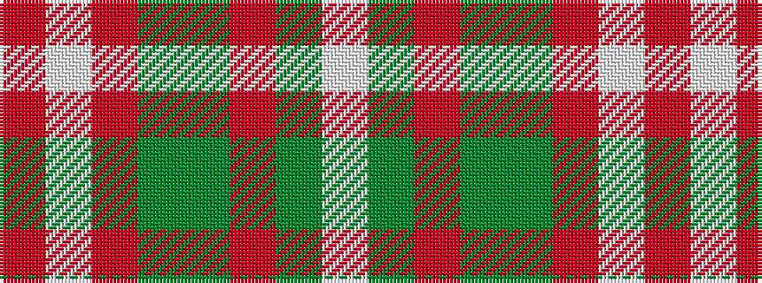

RWRGGRGW

It is a 8 stripe tartan.

<figure class="pat-woven">

<figcaption>idealised sample</figcaption>
</figure>

## Colour Sequence



## Tartans with this colour sequence

| Tartans |
|---------------|
| [Unidentified Ross-shire](/setts/s8/w75dy1r18dg9dy1r27w2r5~x2/)|
||
