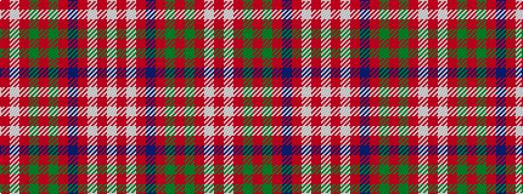

RWRGRGRBRWRW

It is a 12 stripe tartan.

<figure class="pat-woven">

<figcaption>idealised sample</figcaption>
</figure>

## Colour Sequence



## Tartans with this colour sequence

| Tartans |
|---------------|
| [1745 Trading (Corporate)](/variants/s12/r4w2r3dg6r2dg2r2db16r2lb2r32w2~x2/)|
||
