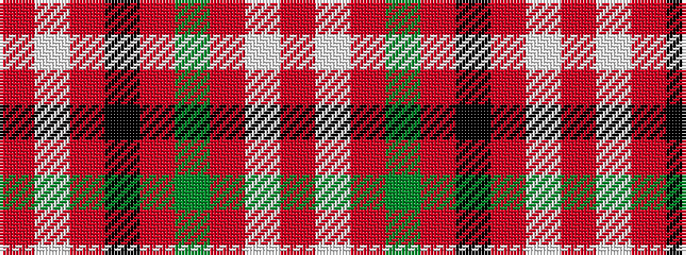

RWRGRKRWR

It is a 9 stripe tartan.

<figure class="pat-woven">

<figcaption>idealised sample</figcaption>
</figure>

## Colour Sequence



## Tartans with this colour sequence

| Tartans |
|---------------|
| [Virginia Military Institute (Milit.)](/setts/s9/r6w30r2k3r30g3r2w25r6~x2/)|
||
