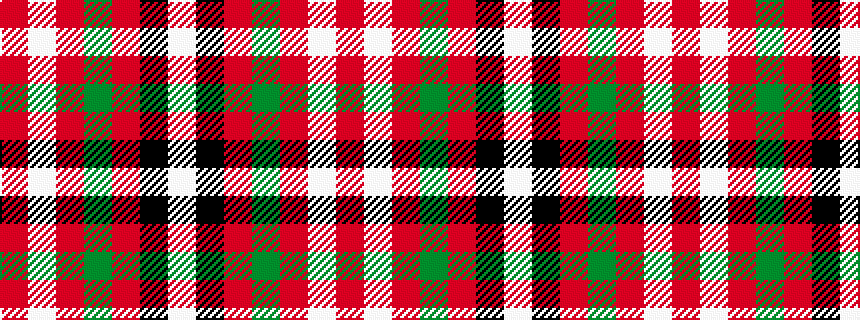

RWRGRKW

It is a 7 stripe tartan.

<figure class="pat-woven">

<figcaption>idealised sample</figcaption>
</figure>

## Colour Sequence



## Tartans with this colour sequence

| Tartans |
|---------------|
| [MMK 1777](/variants/s7/w30k1r7dg7r8w1r2~x4/)|
||
