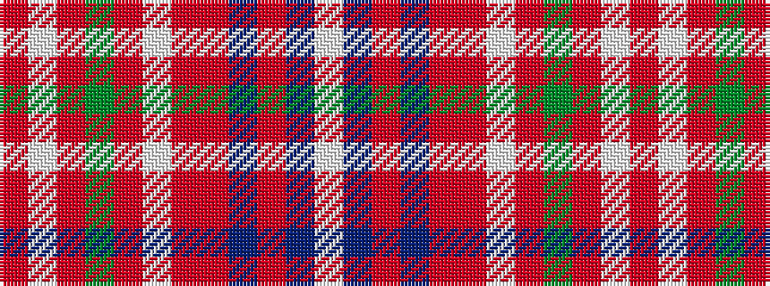

RWRGRWRRBRBW

It is a 12 stripe tartan.

<figure class="pat-woven">

<figcaption>idealised sample</figcaption>
</figure>

## Colour Sequence



## Tartans with this colour sequence

| Tartans |
|---------------|
| [Portree Check (District) Tartan Tartan Number: 1280. Earliest known date: pre 2003 Designed for the Porteous Family Association, and submitted to the Monitoring Committee of the Scottish Tartan Society by Captain Barry Porteous who was president of the association at that time. See products available Copyright © Blair Urquhart, Comrie, 2015](/setts/s12/o38lp4o8dy2o4w3o4r14n7o2n4w2~x2/)|
||
