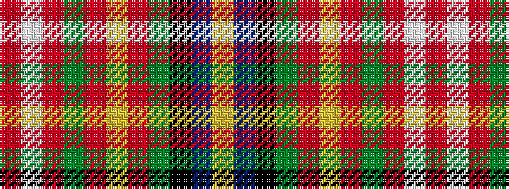

RWRGRYRGKBY

It is a 11 stripe tartan.

<figure class="pat-woven">

<figcaption>idealised sample</figcaption>
</figure>

## Colour Sequence



## Tartans with this colour sequence

| Tartans |
|---------------|
| [Canfield (Personal)](/variants/s11/r5w1r18dg4r6lo4r1g6k13db5lo2~x2/)|
||
