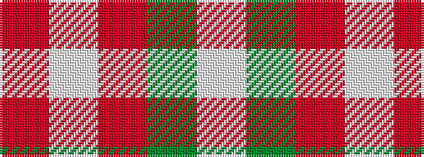

RWRGW

It is a 5 stripe tartan.

<figure class="pat-woven">

<figcaption>idealised sample</figcaption>
</figure>

## Colour Sequence



## Tartans with this colour sequence

| Tartans |
|---------------|
| [Glen Shiel (Fashion)](/setts/s5/r13lb3r1dg3lb1~x6/)|
||
