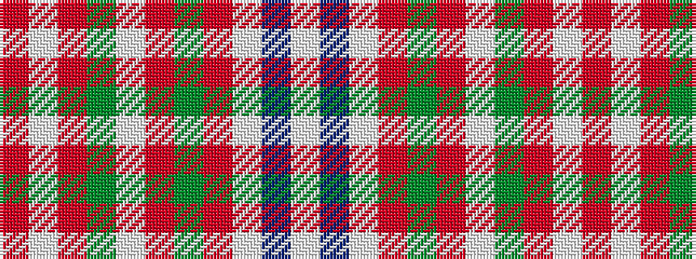

RWRGWRGRWBW

It is a 11 stripe tartan.

<figure class="pat-woven">

<figcaption>idealised sample</figcaption>
</figure>

## Colour Sequence



## Tartans with this colour sequence

| Tartans |
|---------------|
| [Friends of Scotland Caucus](/setts/s11/r3w2r3g14w3r3g2r3w3db47w2~x2/)|
||
