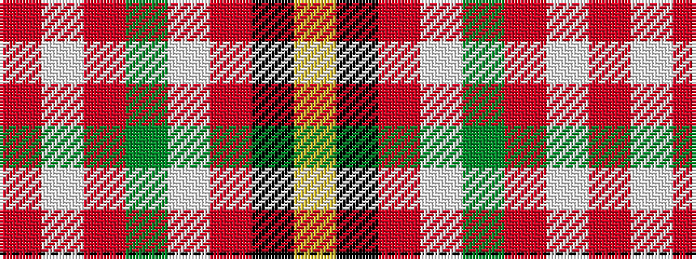

RWRGWRKY

It is a 8 stripe tartan.

<figure class="pat-woven">

<figcaption>idealised sample</figcaption>
</figure>

## Colour Sequence



## Tartans with this colour sequence

| Tartans |
|---------------|
| [MacBrair Hunting](/setts/s8/lo57k1r12lb1g12r14lb1r2~x2/)|
||
