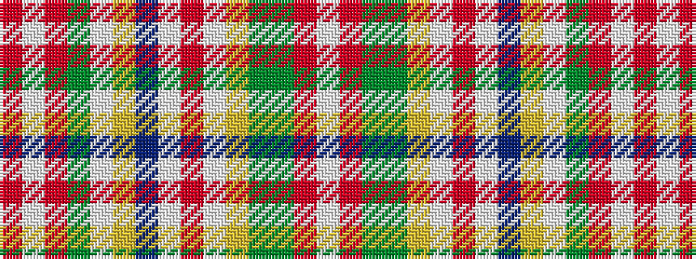

RWRGWYBWRWYGGRW

It is a 15 stripe tartan.

<figure class="pat-woven">

<figcaption>idealised sample</figcaption>
</figure>

## Colour Sequence



## Tartans with this colour sequence

| Tartans |
|---------------|
| [Contrecoeur Dress](/setts/s15/w2o2g2dy1ly10w7r3w13db5ly10w1g2o2w2r1~x4/)|
||
